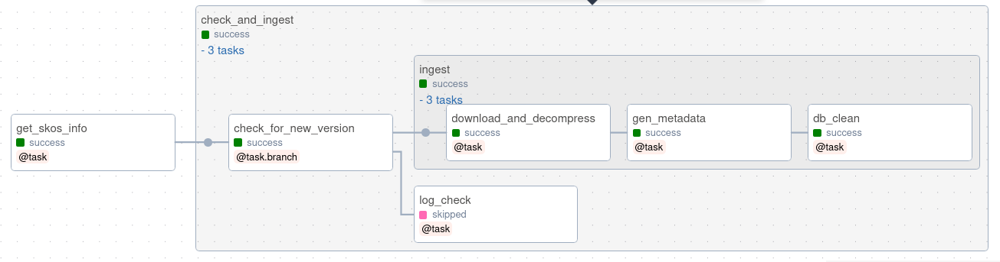

# Adding a New Automated Ingestion

This document provides examples for adding DAGs (Directed Acyclic Graphs) in Airflow to manage download, tracking and analysis of knowledge graphs.

## Objective
The process aims to create, on the data lake, for each graph:

* A metadata file (JSON).
* A directory containing the graph itself.
* An additional metadata file with the ".latest" extension. This is a copy that allows finding the latest version of the corresponding graph.

For example, here is the content stored for the "test" graph after a few updates:
```shell
/data/test_metadata_latest
/data/test_metadata_v10
/data/test_metadata_v8
/data/test_metadata_v9
/data/test_v10
/data/test_v8
/data/test_v9
```

It is possible to keep multiple versions of a graph (2 by default, 3 in the previous example).

## Simple Case

To include a new graph in the cluster, you can start by creating a file `<GRAPH_NAME>_dag.py` in the `dags` directory of Airflow.
(Note : dags are currently located in /home/gulaisney/msd-database-management/dags).
The `skos_dag.py` file is a simple example that can be used as a template.

Start by changing the unique identifier of the DAG and the tags that make it easy to find. This step is important, as the dag_id will be considered as the graph name during exploitation.
```python
dag_id="skos",
tags=["ingestion", "skos"]
```

You can also examine the default parameters, including:
```python
"hdfs_data_dir": "/data"  # directory where the graph will be stored on HDFS
"n_kept_versions": 2  # Number of versions to keep
```

These parameters can be changed later from the Airflow web interface.

The next step is to provide a dictionary that will be used throughout the process. It must contain at least:
* The URL where the file(s) can be found (without the filename, ending with /)
* A string representing the latest available version number
* The graph name, which is still called dir_name. It has to be set to the value of the dag_id you chose before. the get_dag_id() function should be used.
* The compression type, among "gz", "zip", or ""
* The RDF format (according to [RDF4J RDFFormat](https://rdf4j.org/javadoc/4.1.3/org/eclipse/rdf4j/rio/RDFFormat.html) when possible). The (optional) `check_rdf_format_string` function raises an exception if the string is not recognized by Jena.

```python
info = {"download_url": "www.example.com/",
        "version": "123",
        "file_list": ["file1.ttl.gz", "file2.ttl.gz"],
        "dir_name":  get_dag_id(),
        "compression": "gz",
        "format": check_rdf_format_string("TURTLE")
        }
```

This should be sufficient since the rest of the graph (the "check_and_ingest" task group) will take care of the rest.

The workflow is as follows:


### Force complete dag run
The standard graph ingestion can be forced without checking for a new version. To do so, create a file named ```FORCE_UPDATES``` in the directory specified 
by the dag_param "local_temp_repository", which is ```/opt/airflow/ingestion``` by default.

## Less Simple Case

The `knapsack_scrap_dag.py` example provides an overview of the possibilities offered by Docker operators.

The steps are as follows:
* Load an HTML file from a web address to a temporary Hadoop directory on the cluster (Python operator).
* Convert the HTML file to JSON using the pup command line tool, containerized (Docker operator).
* Convert the JSON file to Turtle with a tool written in Scala by Olivier Filangi, also containerized.
* Ingest from a temporary file on HDFS (Python operators).

Here is the workflow:
```python
get_knapsack_html_file() >> html2json >> json2ttl >> get_knapsack_scrap_db_info() >> check_and_ingest()
```

### Example of the DockerOperator `html2json`, image "pup"

The containerized processing is done here on files stored on HDFS, by a Python script. Source files are grouped in the `pupDocker` directory.

#### Docker Part
The Docker image should contain:
* The `pup` utility (the image uses the base `roychri/pup` containing the executable).
* A Python interpreter
* The Python-HDFS package
* The script that will be the entry point of the container (`hdfspup.sh`).

Here is a Dockerfile that creates such an image:
```dockerfile
FROM roychri/pup
USER root

RUN apk update \
ENV PYTHONUNBUFFERED=1
RUN apk add --update --no-cache python3 && ln -sf python3 /usr/bin/python
RUN python3 -m ensurepip
RUN pip3 install --no-cache --upgrade pip setuptools


RUN adduser -D airflow

USER airflow
RUN pip install hdfs
COPY hdfspup.sh /
COPY pup_it.py /
ENTRYPOINT ["/hdfspup.sh"]
```

This image will be added to the local Docker repository with the following command:
```shell
docker build -f Dockerfile -t docker_pup_task .
```

When adding containerized operators, the above command can be added to the "buildDockerOperatorImages.sh" script to automate subsequent (re-)installations.

#### Airflow-Docker Communication
The `pup_it.py` Python script provides an example of Airflow/Docker interaction: script variables are provided by the Docker environment. For example, in the `pup_it.py` script, the input file path is given by:
```python
hdfs_input_path = os.environ["HDFS_INPUT_PATH"]
```

The value is sent from the Airflow DockerOperator code like this:
```python
environment={"HDFS_INPUT_PATH": "{{ params.HDFS_TMP_DIR }}" + "knapsack.html",
             # ...
            },
```

Note the use of a Jinja template to retrieve a DAG parameter:
```python
"{{ params.HDFS_TMP_DIR }}"
```
This string is evaluated at DAG runtime, allowing access to variables before entering task code. Without templating, 
it wouldn't be possible to change DockerOperator values at run, with some Python code for example.  

#### Airflow Part
The Docker entry point is defined in the Dockerfile; the DockerOperator mainly sets environment variables.
```python
html2json_task = DockerOperator(
    task_id='docker_pup',
    image='docker_pup_task',
    auto_remove=True,
    docker_url="unix://var/run/docker.sock",
    mount_tmp_dir=False,
    xcom_all=False,
    environment={
        "HADOOP_USERNAME": "{{ conn.hdfs_connection.login }}",
        "HDFS_INPUT_PATH": "{{ params.HDFS_TMP_DIR }}" + "knapsack.html",
        "HDFS_OUTPUT_PATH": "{{ params.HDFS_TMP_DIR }}" + "knapsack.json",
        "HADOOP_HOST": "http://"+"{{ conn.hdfs_connection.host }}" + ":""{{ conn.hdfs_connection.port }}"
    },
    extra_hosts={"host.docker.internal": "host-gateway"}
)
```

Note the option `mount_tmp_dir=False` and the absence of the use of Docker volumes. This is related to the challenges raised by calling a container from a also containerized Airflow. The use of webHDFS helps bypass the problem.

Finally, to test the Docker image outside of Airflow, the `docker-compose.yaml` file allows launching a container with the environment variables set:
```shell
docker compose up -d # make sure to be in the pupDocker directory
```

### Example of the DockerOperator `json2ttl`, image "knapSackDocker"
This operator launches

 a Scala application that processes files on the Hadoop cluster. The Scala application is containerized using the sbt tool. The `knapsackDocker` directory contains everything needed to create the image.

#### Building the Docker Image with sbt
The code of the application is located in `knapsackDocker/src/main/scala/knapsack/`.

The elements for building the image are in the `build.sbt` file, of which the essential elements are shown here:
```scala
version := "1.0"
scalaVersion :="2.11.12" 
dockerBaseImage := "openjdk:latest"

// +dependencies, etc.

enablePlugins(
  JavaAppPackaging,
  DockerPlugin
)

Docker / packageName := "metabohub/knapsack"
```

Create and locally publish the Docker image using the command:
```shell
sbt docker:publishLocal # run this from the knapsackDocker/ directory
```

You can then verify the presence of the image:
```shell
docker images

REPOSITORY                  TAG                  IMAGE ID       CREATED        SIZE
metabohub/knapsack          1.0                  7ad282eb5f1b   2 days ago     565MB
...
```

Finally, in the DockerOperator configuration, reference the image like this:
```python
json2ttl = DockerOperator(
        task_id='docker_turtle_gen',
        image='metabohub/knapsack:1.0',
        ...
```

#### Airflow/Scala Interactions
As with the `pupDocker` container seen earlier, exchanges are done through environment variables and webHDFS:

There doesn't seem to be a ready-made webHDFS client for Java/Scala, but the Curly package allows making HTTP requests directly.

Authentication by HTTP must be managed. In the case of a non-Kerberos-secured Hadoop configuration, the credentials are base64-encoded and added to the HTTP headers.
```scala
val userPwd = HADOOP_USER_NAME + ":" + HADOOP_PWD
val credentials = Base64.getEncoder.encodeToString(userPwd.getBytes(StandardCharsets.UTF_8))
```

You can then make requests, as shown below, for reading the content of a file with an HTTP GET request.
```scala
val request = Request(HADOOP_URL
  + "/webhdfs/v1/"
  + JSON_INPUT_PATH
  + "?user.name="
  + HADOOP_USER_NAME
  + "&op=OPEN")
  .header("Authorization", "Basic " + credentials)

val hdfsTextFile: String = HTTP.get(request).asString
```

Another example is a PUT request allowing file writing. Writing requires two steps:
1) A request to get the datanode's address.
2) The actual write.
```scala
// 1: write request
val requestPutRes1 = Request(HADOOP_URL
  + "/webhdfs/v1"
  + dir
  + fileName
  + "?user.name="
  + HADOOP_USER_NAME
  + "&op=CREATE&overwrite=true")
  .followRedirects(false)
  .header("Authorization", "Basic " + credentials)

val response = HTTP.put(requestPutRes1)

if (response.status() != 307)
  throw new Exception("Expected 307 at the write request part 1, obtained: " + response.status())

val redirRequest = response
  .headerFields()
  .getOrElse("Location", throw new Exception("Datanode not present in the response? :/"))
  .mkString

// 2: write
val requestPutRes2 = Request(redirRequest)
  .header("Authorization", "Basic " + credentials)
  .body(content.getBytes())

HTTP.put(requestPutRes2)
```

## Use of Xcoms (Cross-Communications)

When the information to be exchanged between tasks is small, you can use Airflow's "xcoms."

For example, here is a Bash operator from the `chebi_dag.py` file. It retrieves a line from a web page and sends it to the next operator.
```python
from airflow.operators.bash import BashOperator
get_chebi_version = BashOperator(
    task_id="get_chebi_version",
    bash_command="curl -s https://ftp.ebi.ac.uk/pub/databases/chebi/ontology/ | grep chebi.owl.gz",
    do_xcom_push=True,
)
```

The Python operator that follows can then retrieve this information using the `xcom_pull` method, like this:
```python
def get_chebi_info(**kwargs):
    ti = kwargs['task_instance']
    version_source = ti.xcom_pull(key='return_value', task_ids='get_chebi_version')
```
